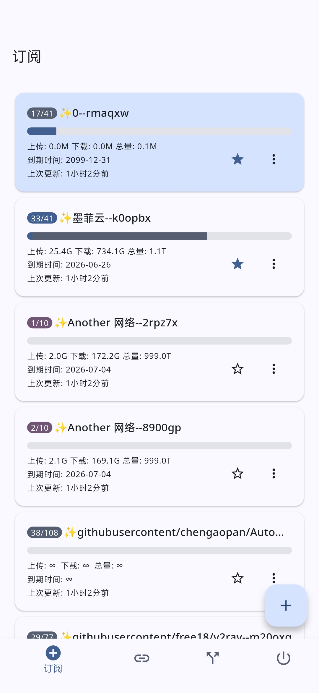
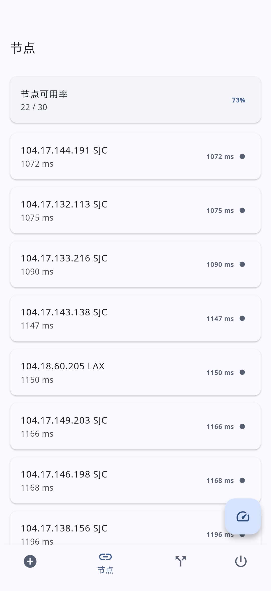
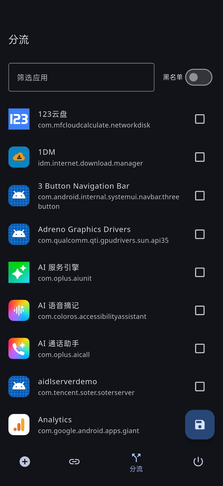
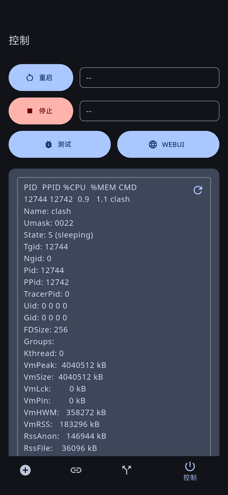

# ClashRoot

<p align="center">
  
</p>

<h3 align="center">ClashRoot</h3>

<p align="center">
  基于Flutter框架的Clash内核控制器,仅限KernelSU<br>
  订阅切换、配置覆写、内核启停<br>
  <a href="https://github.com/4evergr8/ClashRoot/issues/new">🐞故障报告</a>
  ·
  <a href="https://github.com/4evergr8/ClashRoot/issues/new">🏹功能请求</a>
</p>

## 目录

- [主要功能](#主要功能)
- [Screenshots](#screenshots)
- [食用方法](#食用方法)
- [配置文件](#配置文件)
- [引用](#引用)


## 主要功能

- 磁贴控制核心启停
- 通知监控网速
- 分应用代理,支持白名单和黑名单模式
- 批量添加Clash订阅
- 删除订阅
- 切换订阅
- 批量更新订阅
- 订阅覆写
- 从返回头自动获取配置名称和流量信息
- 对配置中的所有节点进行测速,可自定义超时和测速链接
- 查看核心状态

## Screenshots

<table>
  <tr>
    <td width="25%"></td>
    <td width="25%"></td>
    <td width="25%"></td>
    <td width="25%"></td>
  </tr>
</table>
## 食用方法

1. 前往[Release](https://github.com/4evergr8/ClashRoot/releases)下载对应架构的APK和ClashRoot.zip
2. 在KernelSU内安装ClashRoot.zip,授予ClashRoot应用root权限,重启设备
3. 由于每次构建会生成不同的签名,只有开启核心破解后才能更新app,无法更新请前往模块目录手动安装apk
4. 添加订阅,选中订阅后重启核心
5. 前往WebUI观察运行情况

## 配置文件

### settings.yaml 软件设置

```yaml
ua: "clash.meta"
#下载订阅时使用的User-Agent
port: 9090
#软件打开的控制端口,需要和配置中的端口对应
timeout: 10000
#下载订阅超时,毫秒
url: "https://www.google.com"
#节点测速链接
testtimeout: 3000
#节点测速超时,毫秒
```

### subscriptions.yaml 订阅信息

```yaml
subscriptions:
  - id: "example"
    #订阅的ID,链接标准化后,进行SHA256计算,取前8位,同时用作文件名
    link: ""
    #订阅下载链接
    label: "测试订阅"
    #订阅显示名称
    upload: 536870912000
    #订阅已使用上传流量(来自服务商)
    download: 536870912000
    #订阅已使用下载流量(来自服务商)
    total: 1073741824000
    #订阅套餐总量(来自服务商)
    expire: 1775696117
    #订阅到期时间(来自服务商)
    update: 0
    #上次更新时间
    count: 0
    #可用节点数量
    favorite: false
    #是否收藏订阅,收藏的订阅会被置顶
    select: false
    #是否选中订阅
```

### override.yaml 非递归配置覆写

```yaml
mode: rule
external-controller: 127.0.0.1:9090
external-ui: ./metacubexd
allow-lan: false
log-level: warning
ipv6: true
keep-alive-idle: 15
keep-alive-interval: 10
disable-keep-alive: false
unified-delay: true
tcp-concurrent: true
geodata-loader: memconservative
find-process-mode: off
geo-auto-update: true
geo-update-interval: 24
etag-support: true
geodata-mode: true
geox-url:
  geoip: "https://github.com/Loyalsoldier/v2ray-rules-dat/releases/latest/download/geoip.dat"
  geosite: "https://github.com/Loyalsoldier/v2ray-rules-dat/releases/latest/download/geosite.dat"
profile:
  store-selected: false
  store-fake-ip: true

tun:
  enable: true
  stack: "gvisor"
  device: "tun0"
  auto-route: true
  auto-detect-interface: true
  strict-route: true


dns:
  enable: true
  cache-algorithm: lru
  prefer-h3: false
  listen: 0.0.0.0:1053
  ipv6: true
  enhanced-mode: fake-ip
  fake-ip-range: 198.18.0.1/16
  fake-ip-filter-mode: blacklist
  fake-ip-filter:
    - geosite:cn
    - geosite:private
  use-hosts: false
  use-system-hosts: true
  default-nameserver:
    - tls://1.12.12.12:853
    - tls://223.5.5.5:853
  nameserver:
    - https://dns.alidns.com/dns-query#h3=true
    - https://doh.pub/dns-query

```


## 引用

- 本项目采用GitHub Action进行编译
- 软件界面参考[chen08209/FlClash](https://github.com/chen08209/FlClash)
- WebUI来自[MetaCubeX/metacubexd](https://github.com/MetaCubeX/metacubexd)
- 规则集合来自[Loyalsoldier/v2ray-rules-dat](https://github.com/Loyalsoldier/v2ray-rules-dat)
