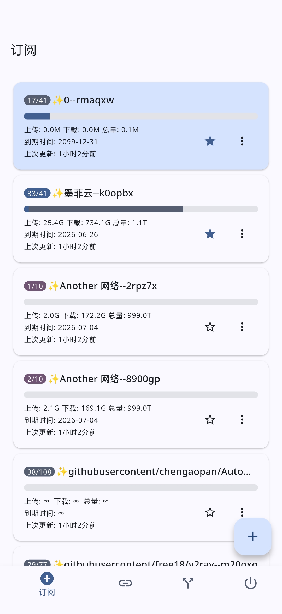
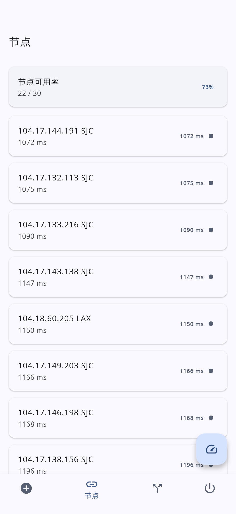
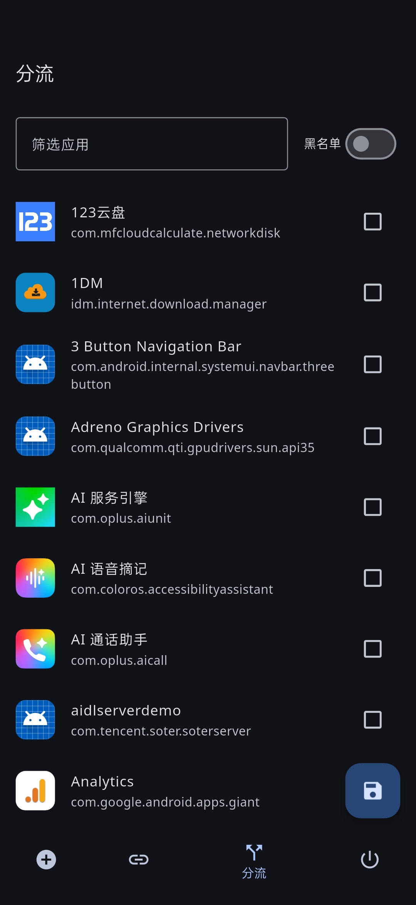
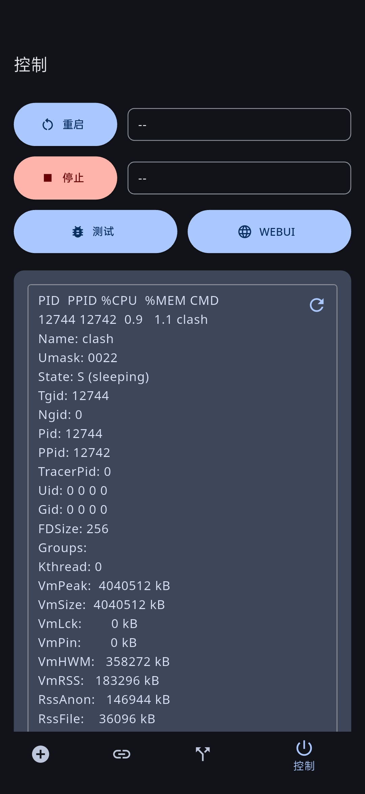
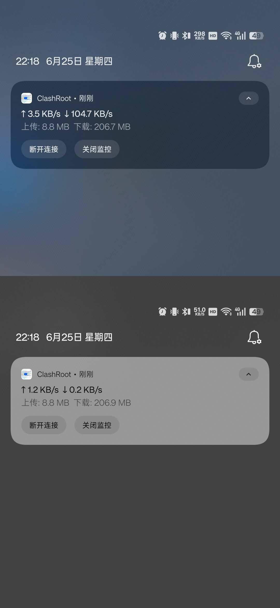

# ClashRoot

<p align="center">
  


</p>

<h3 align="center">ClashRoot</h3>

<p align="center">
  基于Flutter框架的Clash内核控制器,仅限KernelSU<br>
  订阅切换、内核启停、分应用分流<br>
  <a href="https://github.com/4evergr8/ClashRoot/issues/new">🐞故障报告</a>
  ·
  <a href="https://github.com/4evergr8/ClashRoot/issues/new">🏹功能请求</a>
</p>

## 目录

- [主要功能](#主要功能)
- [Screenshots](#screenshots)
- [食用方法](#食用方法)
- [配置说明](#配置说明)
- [编译](#编译)
- [引用](#引用)

## 主要功能

- 磁贴控制核心启停
- 分应用代理,支持白名单和黑名单模式
- 批量添加Clash订阅
- 删除订阅
- 切换订阅
- 批量更新订阅
- 从响应头自动获取订阅名称和流量信息
- 订阅更新时间取自订阅文件的修改时间
- 对第一个代理组内的节点进行测速,可自定义超时和测速链接
- 查看核心状态、测试配置文件

## Screenshots

<table>
  <tr>
    <td width="25%"></td>
    <td width="25%"></td>
    
   
  </tr>
</table>
<table>
  <tr>
<td width="25%"></td>
    <td width="25%"></td>
    <td width="25%"></td>
  </tr>
</table>
## 食用方法

1. 前往[Release](https://github.com/4evergr8/ClashRoot/releases)下载对应架构的APK和ClashRoot.zip
2. 在KernelSU内安装ClashRoot.zip,授予ClashRoot应用root权限,重启设备
3. 由于每次构建会生成不同的签名,只有开启核心破解后才能更新app,无法更新请前往模块目录手动安装apk
4. 添加订阅后点击订阅卡片选中它,软件会把该订阅的链接与文件路径写入`config.yaml`的`proxy-providers`,并重启核心
5. **首次安装必须先选中一次订阅**:模块内置的`config.yaml`里provider没有url,未选中过订阅时核心拿不到节点,节点页会一直等待
6. 前往WebUI观察运行情况

## 配置说明

### data.yaml 软件数据

位于模块目录`/data/adb/modules/ClashRoot/data.yaml`,由软件维护。

```yaml
ua: "clash.meta"
#下载订阅时使用的User-Agent
port: 9090
#软件打开的控制端口,需要和配置中的端口对应
timeout: 10000
#下载订阅超时,毫秒
url: "https://www.google.com"
#节点测速链接
secret: "111111"
#Clash API密码,若config.yaml中设置了secret,两者需一致
testtimeout: 3000
#节点测速超时,毫秒
expected: 200
#节点测速返回码,只有匹配的返回码才算alive
subscriptions:
  - id: "example"
    #订阅的ID,链接标准化后,进行SHA256计算,取前8位,同时用作文件名
    link: "https://raw.githubusercontent.com/4evergr8/FlutterClashRoot/refs/heads/main/ClashRoot/config.yaml"
    #订阅下载链接
    label: "测试订阅"
    #订阅显示名称
    upload: 536870912000
    #订阅已使用上传流量(来自服务商)
    download: 536870912000
    #订阅已使用下载流量(来自服务商)
    total: 1073741824000
    #订阅套餐总量(来自服务商)
    expire: 1775696117
    #订阅到期时间(来自服务商)
    count: 0
    #最近一次测速的节点总数
    alive: 0
    #最近一次测速中延迟低于testtimeout的节点数
    favorite: true
    #是否收藏订阅,收藏的订阅会被置顶
    select: true
    #是否选中订阅
```

订阅的「上次更新」不保存在此文件中,而是读取`/data/adb/modules/ClashRoot/config/$id.yaml`的文件修改时间,
因此通过其他方式(如核心按`interval`自动拉取)更新订阅后,软件显示的时间也会同步。

### config.yaml 核心配置

位于模块目录`/data/adb/modules/ClashRoot/config.yaml`,即Clash/Mihomo的运行配置,规则、代理组、DNS等均在此维护。

切换订阅时,软件只改动`proxy-providers`的**第一个**provider,其余内容原样保留:

```yaml
proxy-providers:
  provider:
    type: http
    url: ""
    #切换订阅时写入该订阅的link
    path:
    #切换订阅时写入 ./config/$id.yaml,即订阅文件
    interval: 10800
    size-limit: 0
    header:
      User-Agent:
        - "clash.meta"
    exclude-filter: "订阅|频道|到期|官网|剩余|RU|俄罗斯|🇷🇺"
```

几点说明:

- `path`使用相对路径,基准目录是核心的`-d`目录,即模块根目录
- 分应用分流的名单写入本文件的`tun`段(`include-package`白名单 / `exclude-package`黑名单),保存后自动重启核心
- 节点页测速取的是`proxy-groups`的**第一个**代理组:组名从本文件读取,组内成员和延迟向核心查询。
  核心内置的GLOBAL组不参与,所以该组不存在也不影响
- 若第一个代理组是`select`类型,测速接口无延迟概念,页面会显示核心返回的错误信息

## 编译

本项目使用GitHub Action编译,无需本地环境。

在Actions页面手动运行`ClashRoot`工作流,可选填写`version`参数:

| 输入 | 行为 |
| --- | --- |
| 留空 | 沿用当前版本号,只在版本后追加commit hash,**不产生提交** |
| `2.2.4` | 写入`pubspec.yaml`与`ClashRoot/module.prop`,`versionCode`各+1,版本号追加commit hash,并自动提交推送 |

产物有两个:

- `ClashRoot-Module`:模块压缩包,内含mihomo、metacubexd、geoip/geosite
- `ClashRoot-APK`:应用安装包

模块包在APK编译**之前**上传,所以即使APK编译失败,模块包依然可以下载。

## 引用

- 本项目采用GitHub Action进行编译
- 部分软件界面参考[chen08209/FlClash](https://github.com/chen08209/FlClash)
- WebUI来自[MetaCubeX/metacubexd](https://github.com/MetaCubeX/metacubexd)
- 规则集合来自[Loyalsoldier/v2ray-rules-dat](https://github.com/Loyalsoldier/v2ray-rules-dat)
